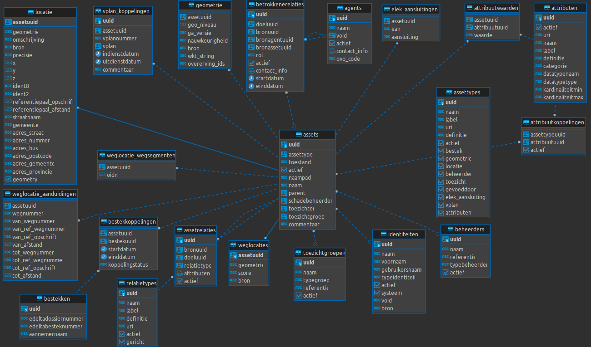

#AWVInfra PostGIS Syncer

## Summary
This project aims to sync the data from the AWVInfra (Infra Db) database to a PostGIS database. The data is stored in the AWVInfra database in a specific format. The data is retrieved through the API and stored in the PostGIS database.

## Datamodel

